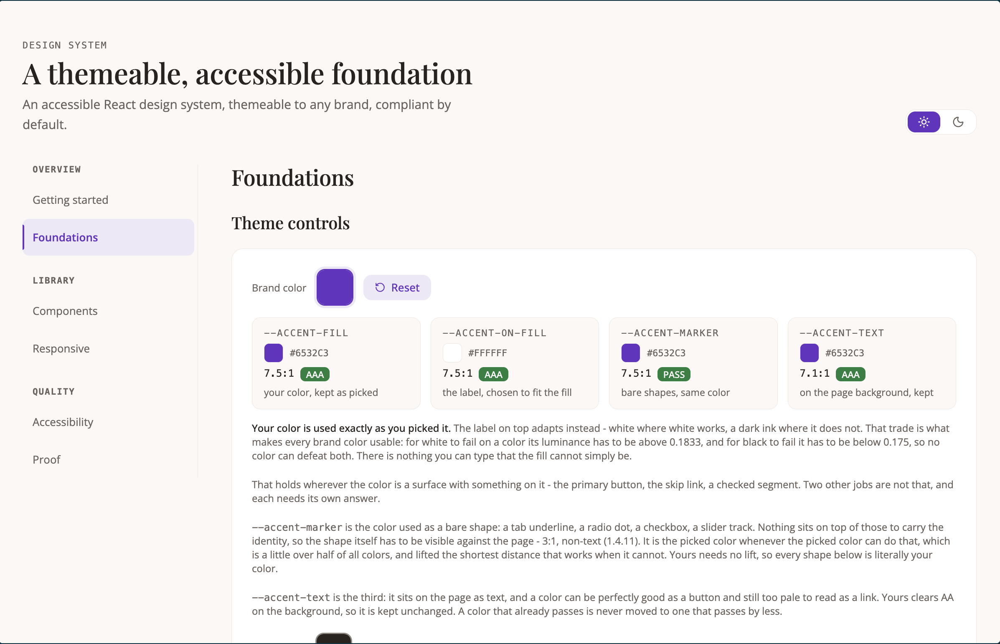
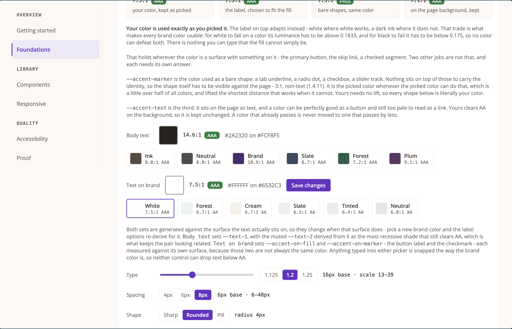
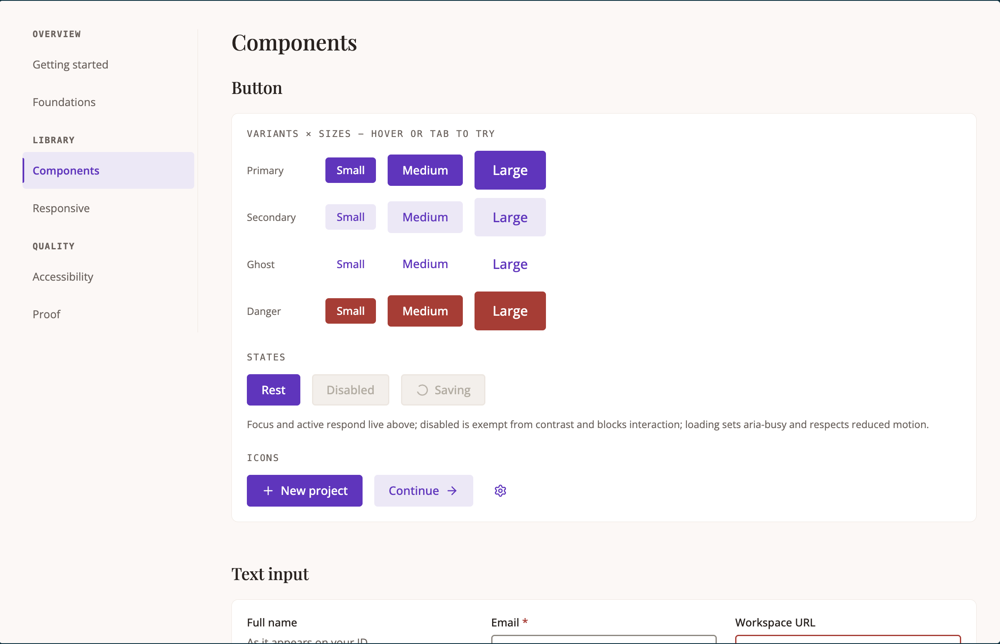
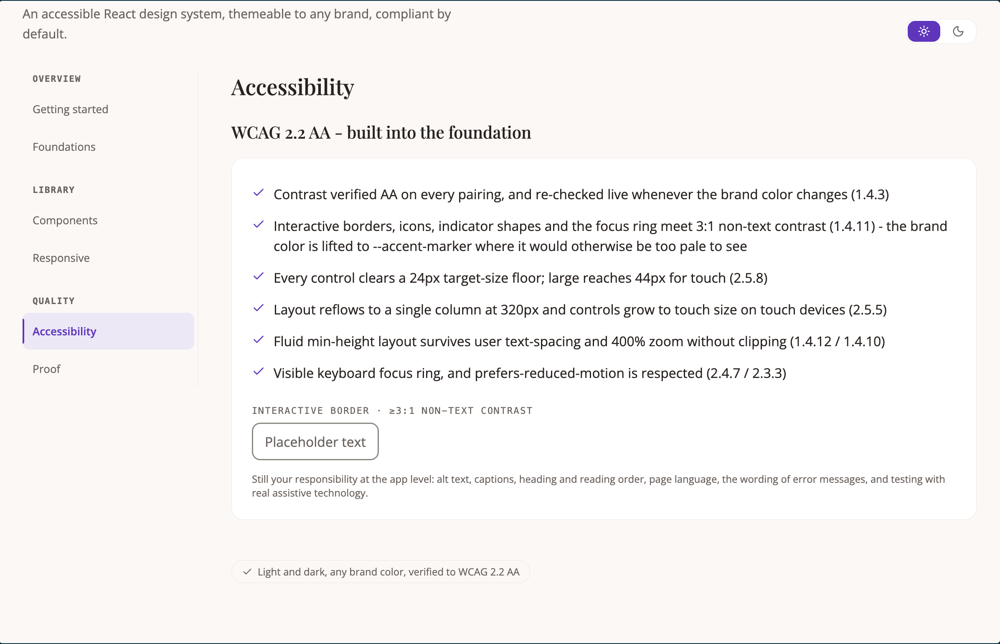
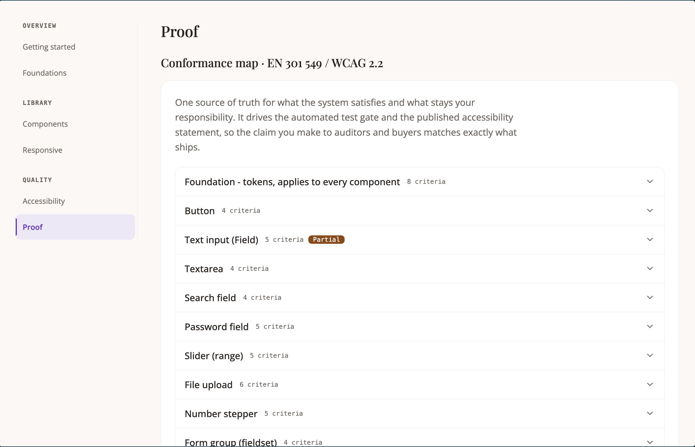

> Please note! this design system is still under developent

# accessible-design-system

A themeable React design system where accessibility is a property of the
construction, not the result of an audit.

40 components, 170 tests, and a conformance map that drives the style guide, the
published accessibility statement and the test gate from one source - so the
claim made to auditors is exactly what ships.

---

## The idea

It's commonly known that accessibility is often forgotten when developing applications. It could be due to lack of time, resources or sometimes interest. The idea behind this project is to reduce the effort needed to create a customizable, elegant, and responsive design system, while being **fully accessible** by default.

Users start by specifying basic details such as brand colors, typography, shapes, spacing etc. and they get a coherent and customized design system that is accessible from the start.

